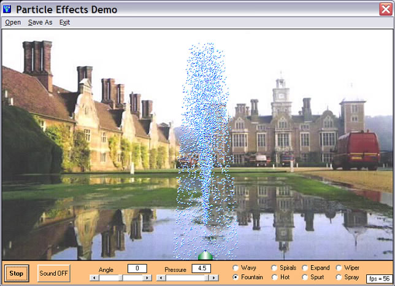



## Particle Effects Demo\(Update 10Jun08\)

### Description

Particle Effects Demo by Robert Rayment (Update 10Jun08). Demonstration of a particle engine with various effects. Note that the green and white particle emitter can be moved around with the mouse. Also any pictures opened are auto-sized to a fixed display size... Update 10 Jun: Minor update to Sound ON/OFF caption which was reversed. Zip 135 Kb.
 
### More Info
 
Picture

Just run

             |
---                |---
**Submitted On**   |2008-06-03 07:55:04
**By**             |[Robert Rayment](https://github.com/Planet-Source-Code/PSCIndex/blob/master/ByAuthor/robert-rayment.md)
**Level**          |Intermediate
**User Rating**    |5.0 (65 globes from 13 users)
**Compatibility**  |VB 6\.0
**Category**       |[Graphics](https://github.com/Planet-Source-Code/PSCIndex/blob/master/ByCategory/graphics__1-46.md)
**World**          |[Visual Basic](https://github.com/Planet-Source-Code/PSCIndex/blob/master/ByWorld/visual-basic.md)
**Archive File**   |[Particle\_E2115926102008\.zip](https://github.com/Planet-Source-Code/robert-rayment-particle-effects-demo-update-10jun08__1-70623/archive/master.zip)

### API Declarations

See code

